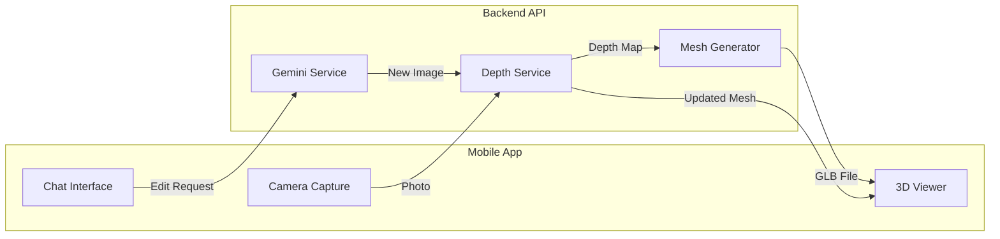

# Photo to 3D Room Visualization

## Architecture Overview




## Data Flow

1. User takes photo with camera
2. Photo sent to backend `/depth/generate-mesh` endpoint
3. MiDaS generates depth map from photo
4. Open3D converts depth map + photo into textured 3D mesh (GLB)
5. GLB returned to mobile app
6. `model_viewer_plus` displays interactive 3D view
7. User requests edits via chat ("change wall color to blue")
8. Gemini edits the 2D image
9. New depth map and mesh generated
10. 3D view updates with changes

---

## Part 1: Disable Unity References

Comment out Unity-related code in mobile app:

- [mobile/lib/screens/room_scan_screen.dart](mobile/lib/screens/room_scan_screen.dart) - Replace with new Quick Scan screen
- [mobile/lib/screens/room_editor_screen.dart](mobile/lib/screens/room_editor_screen.dart) - Comment out Unity placeholders
- [mobile/pubspec.yaml](mobile/pubspec.yaml) - Unity widget already commented out (line 51-52)

---

## Part 2: Backend - Depth Estimation Service

### New Dependencies

Add to [backend/requirements.txt](backend/requirements.txt):

```
torch>=2.0.0
torchvision>=0.15.0
timm>=0.9.0
open3d>=0.17.0
numpy>=1.24.0
scipy>=1.10.0
```

### New Service: `depth_service.py`

Create [backend/app/services/depth_service.py](backend/app/services/depth_service.py):

- `generate_depth_map(image_base64)` - Run MiDaS model on image
- `create_mesh_from_depth(image_base64, depth_map)` - Use Open3D to create textured mesh
- `save_mesh_as_glb(mesh, room_id)` - Export mesh to GLB format

Key implementation:

```python
import torch
import open3d as o3d
import numpy as np

class DepthService:
    def __init__(self):
        self.model = torch.hub.load("intel-isl/MiDaS", "DPT_Hybrid")
        self.transform = torch.hub.load("intel-isl/MiDaS", "transforms").dpt_transform
        
    def generate_depth_map(self, image_base64: str) -> np.ndarray:
        # Decode image, run MiDaS, return depth map
        
    def create_mesh(self, image_base64: str, depth_map: np.ndarray) -> str:
        # Create point cloud from depth
        # Generate mesh using Poisson reconstruction
        # Apply original image as texture
        # Return GLB file path
```

### New Router: `depth.py`

Create [backend/app/routers/depth.py](backend/app/routers/depth.py):

**Endpoints:**

- `POST /api/v1/depth/generate-mesh` - Take photo, return GLB mesh
- `POST /api/v1/depth/update-mesh` - Re-generate mesh after image edit
- `GET /api/v1/depth/mesh/{room_id}` - Download mesh file

### Update Main App

Register new router in [backend/app/main.py](backend/app/main.py):

```python
from .routers import depth
app.include_router(depth.router, prefix="/api/v1")
```

---

## Part 3: Mobile - Quick Scan Screen

### New Dependencies

Add to [mobile/pubspec.yaml](mobile/pubspec.yaml):

```yaml
model_viewer_plus: ^1.10.0
```

### Replace Room Scan Screen

Rewrite [mobile/lib/screens/room_scan_screen.dart](mobile/lib/screens/room_scan_screen.dart):

**New Flow:**

1. Opens camera immediately
2. User takes photo
3. Shows loading indicator ("Generating 3D view...")
4. Calls backend `/depth/generate-mesh`
5. Displays 3D model using `ModelViewer` widget
6. Shows "Edit in Chat" button to continue editing

**Key Widget:**

```dart
ModelViewer(
  src: meshUrl,  // GLB file URL from backend
  alt: "Room 3D View",
  ar: false,
  autoRotate: true,
  cameraControls: true,
)
```

### Update API Service

Add to [mobile/lib/services/api_service.dart](mobile/lib/services/api_service.dart):

```dart
Future<String> generateMeshFromPhoto(File imageFile) async {
  // POST to /depth/generate-mesh
  // Return mesh URL
}
```

### Update Chat Integration

Modify [mobile/lib/providers/chat_provider.dart](mobile/lib/providers/chat_provider.dart):

- Add `currentMeshUrl` state
- After image edits, trigger mesh regeneration
- Notify 3D viewer to reload

---

## Part 4: Edit Flow Integration

When user sends edit request in chat:

1. Gemini edits the 2D image (existing flow)
2. Backend detects mesh exists for conversation
3. Automatically regenerates mesh from new image
4. Returns both edited image AND new mesh URL
5. Mobile updates both chat image and 3D viewer

Update [backend/app/routers/chat.py](backend/app/routers/chat.py):

```python
# After Gemini generates edited image:
if conversation_has_mesh(conversation.id):
    new_mesh_url = await depth_service.regenerate_mesh(
        conversation.id, 
        edited_image_base64
    )
    # Include in response
```

---

## File Changes Summary

**Backend - New Files:**

- `backend/app/services/depth_service.py` - MiDaS + Open3D integration
- `backend/app/routers/depth.py` - Depth/mesh endpoints

**Backend - Modified Files:**

- `backend/requirements.txt` - Add torch, open3d, timm
- `backend/app/main.py` - Register depth router
- `backend/app/routers/chat.py` - Trigger mesh regeneration on edits
- `backend/app/models/schemas.py` - Add mesh-related schemas

**Mobile - Modified Files:**

- `mobile/pubspec.yaml` - Add model_viewer_plus
- `mobile/lib/screens/room_scan_screen.dart` - Complete rewrite for Quick Scan
- `mobile/lib/services/api_service.dart` - Add mesh API calls
- `mobile/lib/providers/chat_provider.dart` - Add mesh state management

**Mobile - Files to Comment Out:**

- `mobile/lib/screens/room_editor_screen.dart` - Unity placeholder (keep for reference)

---

## Performance Considerations

- MiDaS model loading: Load once at startup, keep in memory
- Mesh generation: 2-5 seconds per image (DPT_Hybrid model)
- GLB file size: ~1-5MB depending on mesh complexity
- Consider adding a "lite" mode with smaller MiDaS model for faster results

